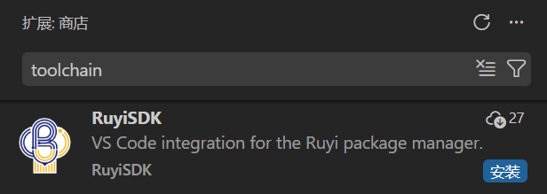

# Marketplace搜索KeyWords

## 操作步骤
1. 打开Vscode Marketplace
2. 搜索riscv、risc-v、toolchain、package manager、virtual environment等KeyWorlds安装插件

## 预期结果
能够根据关键词在Marketplace搜索到RuyiSDK插件

## 测试结果
能够根据关键词在Marketplace搜索到RuyiSDK插件

