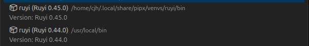
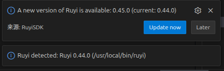

# 开启vscode时ruyi版本更新提示冲突

## 操作步骤

1. 以不同方法安装多个版本的 ruyi，并且在 VSCode 中的 ruyi 包管理器可以自由切换版本。

2. 用旧版本打开 Visual Studio Code。

## 预期结果
ruyi会弹出新版本ruyi的更新提示，询问是否更新。

## 测试结果
以不同方法安装了多个版本的ruyi，比如最新版的 ruyi和旧版的ruyi安装方式不一致，在使用较旧版本的ruyi时打开vscode时，系统仍会提示是否需要更新 ruyi 包管理器的最新版本以及是否需要进行更新操作。  

