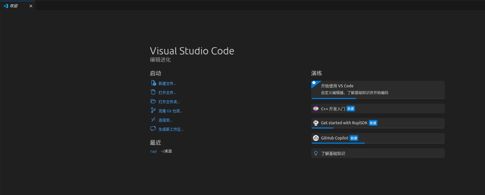
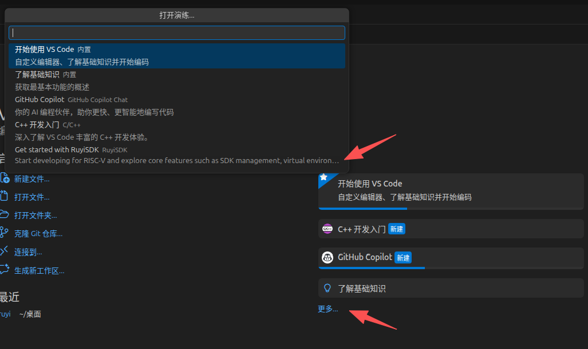
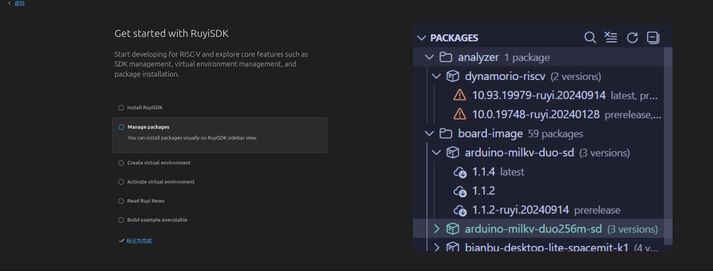

# 主页插件引导

## 操作步骤
1. 打开VScode，显示欢迎界面首次会显示 Get Start  With RuyiSDK 插件引导
2. 后续在更多选项可以正常显示并打开插件引导

## 预期结果
打开VScode，欢迎界面正常显示插件引导，并且后续可以在更多选项显示并打开插件引导

## 测试结果
打开VScode，欢迎界面正常显示插件引导，并且后续可以在更多选项显示并打开插件引导

