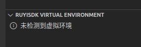
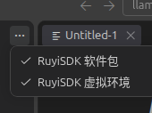
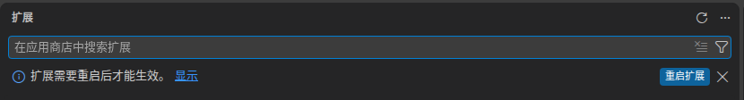
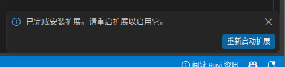
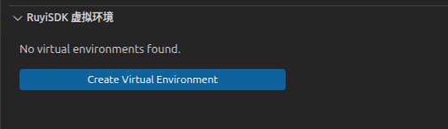
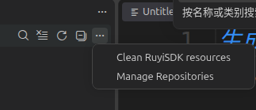

# 版本切换过程中中英文切换不灵活
不清楚算不算是个bug，和[issue136](https://github.com/ruyisdk/ruyisdk-vscode-extension/issues/136)有点像也不太像,虽然说重启vscode就可以了
顺带提一下先

测试版本：v0.1.5 v0.1.6-beta.1
测试流程：
当前扩展插件为 v0.1.5时的中英文情况
- 虚拟环境

-  镜像源

-通过手动安装 v0.1.6-beta安装包时有尝试以下两个弹窗去重启插件，

然后在当前Windows页面下导致了i18n中文翻译异常？
- 虚拟环境

- 镜像源

更多汉化问题[223](https://github.com/ruyisdk/ruyisdk-vscode-extension/issues/223),[224](https://github.com/ruyisdk/ruyisdk-vscode-extension/issues/224),[228](https://github.com/ruyisdk/ruyisdk-vscode-extension/issues/228),[230](https://github.com/ruyisdk/ruyisdk-vscode-extension/issues/230)

reload Windows后恢复正常