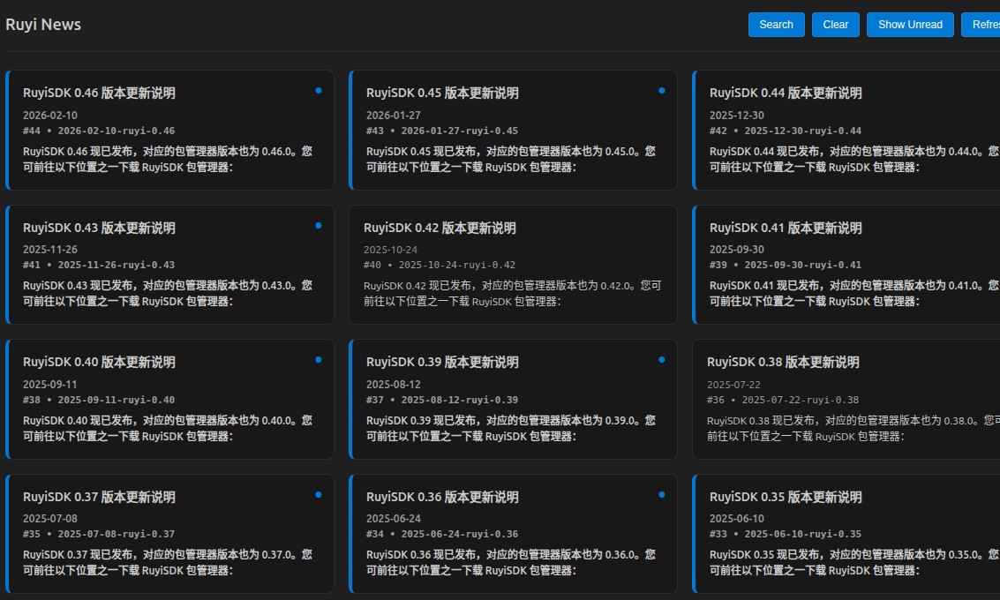
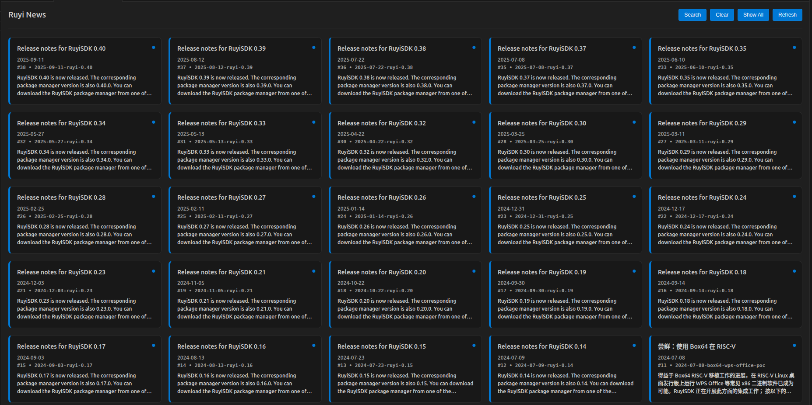
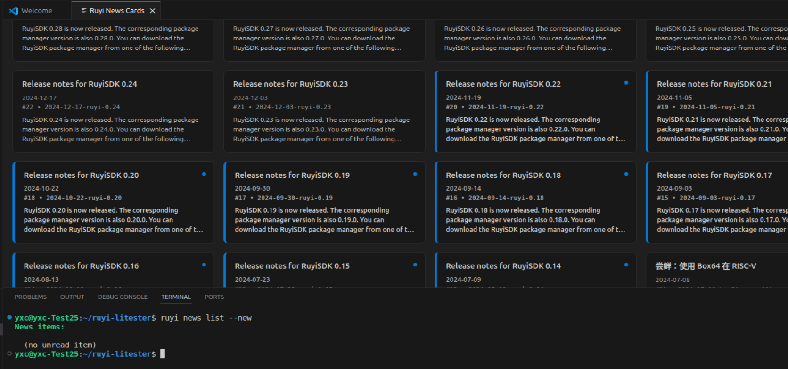
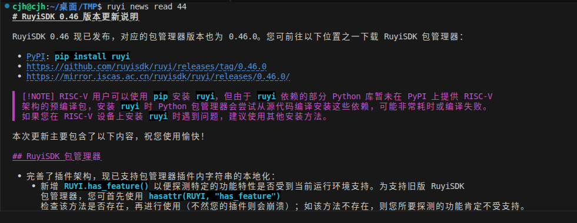
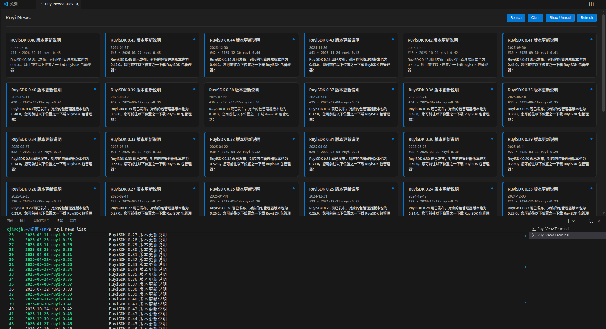

# 切换仅未读

## 操作步骤

1. 点击“Show Unread”按钮
2. 命令行查看未读列表
3. ruyi端阅读新闻后，终端输入 `ruyi news list`, vscode端重新打开Read RuyiNews
## 预期结果

能够正常切换到仅未读状态，页面刷新后将未读卡片滤出显示

命令行成功输出未读新闻列表

ruyi端阅读新闻后，vscode端新闻状态会及时更新

## 测试结果

能够正常切换到仅未读状态，页面刷新后将未读卡片滤出显示

命令行未输出未读新闻列表

命令行阅读未读新闻

ruyi端和vscode端新闻状态正常刷新

