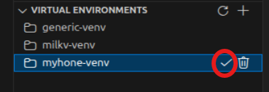
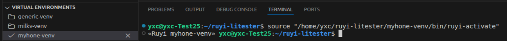
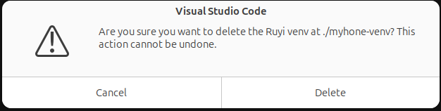

# 管理和激活虚拟环境

## 操作步骤

1. 点击左侧栏中虚拟环境的对号按钮进行激活虚拟环境
2. 点击虚拟环境的叉号按钮退出虚拟环境
3. 点击删除按钮删除虚拟环境

## 预期结果

能够正常激活并切换到指定虚拟环境
能够正常退出虚拟环境
能够正常删除虚拟环境

## 实际结果

能够正常激活并切换到指定虚拟环境
能够正常退出虚拟环境
能够正常删除虚拟环境

issue(已关闭)：[手动退出虚拟环境后左侧视图不能同步 #105](https://github.com/ruyisdk/ruyisdk-vscode-extension/issues/105)
